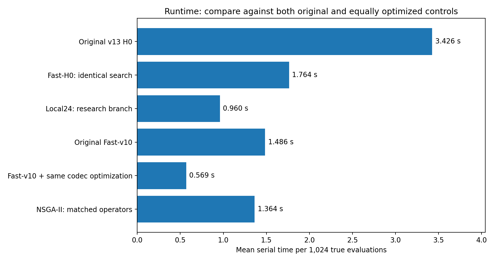
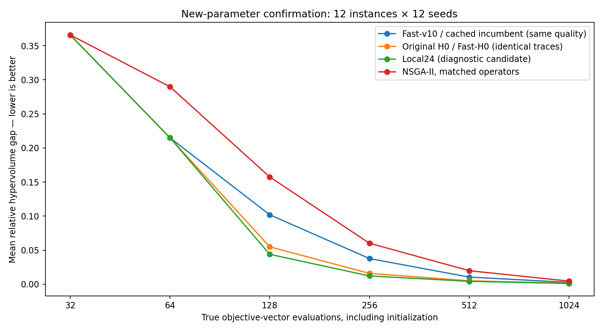

# MOSAIC v14 Efficiency Lab：先保留轨迹加速，再独立研究优化能力

研究日期：2026-09-05。输入为真实上传v13源码。**本轮实现并验证了H0执行加速；改变候选分布的新质量支线仍显式隔离。默认兼容入口不变。**

## 1. 最重要的结论

- Fast-H0与原v13 H0：180个完整配对，已评价X/F与末期返回X/F全部逐元素一致。清洁串行中位时间比0.519689，耗时下降48.03%，约1.924倍速度。它没有新的搜索质量增益，保留的是v13质量。
- 原成本门：Fast-H0相对未改Fast-v10中位比1.218<1.8，原v13未过的成本条件本轮通过。
- 但同样编码加速给Fast-v10后，中位耗时降低61.93%；Fast-H0仍约为这个更公平廉价对照的3.188倍。**不能只与旧慢代码比较后宣布总成本问题完全消失。**
- Local24相对Fast-H0的确认AUC缺口下降3.3239%，串行中位耗时进一步下降44.93%。但它未通过开发质量晋级，原RGV补充也有反例，仍不是默认替代。
- Refit32确认AUC改善1.9251%，低于3%实用门槛，不合并。

## 2. 本轮真实运行与范围

1884次正式完整搜索，1,843,200次真实搜索评价。18个有限参考、1,972,800次独立认证评价。记录48次丢弃JIT预热。单元测试、cProfile、被工具时限中断的剖析/快速冒烟不混入正式搜索计数，不能把本表说成整个会话所有CPU工作总量。

开发4个已知实例×4种子×512FE，分两阶段160+128运行。主确认12个新参数实例×12种子×8方法=1152运行，1024FE、种群32。辅助：同池上限72次；原RGV60次；12/16实体压力60次；清洁串行108次；补充同codec主干等价144次。

RGV来源为2018国赛B单工序、无故障、周期访问策略子类，F=(-完成产品数,累计移动时间)，后者为研究新增目标。路线与迟交作业是合成模型。所有原题时序和终端作业假设保持不变，不冒称完整原题解答。新参数仍属于三个已知家族，不是12个新领域。

## 3. 剖析定位

开发前cProfile的RGV诊断中，mutate的累计时间约4.50/6.68秒，约67%；15次模型fit累计约0.15秒。累计函数时间会重叠，不能把各层百分比相加。它提示主要优化对象是变异、编码、解码、语义特征和重复几何处理，而不是先换一个更大的模型。cProfile有探针开销，其秒数不用于正式提速结论。

## 4. 工程加速：保持每一次决策不变

1. 纯策略codec共享缓存：随机键→规范策略元组、元组→规范编码；合法变异改用序列操作，保留原随机数调用顺序。
2. 按实际策略缓存语义特征：实体选择、位置、边、集合大小。模型训练行序和真值不变，不缓存未知目标。
3. 前沿与参考点完全相同时复用HVI条带；前沿变化失效；不跨模型缓存预测。
4. 缓存返回副本，避免调用者修改内部状态。

Ridge、64FE拟合周期、权限门、20%原路径探索、最大8候选、并列处理、目标评价器、档案接受、FE预算全部不变。具体公式见docs/METHODS_CN.md。缓存提高执行效率，不声称发明新的EHVI或降低了Ridge矩阵求解复杂度。

主确认每个Fast-H0运行平均约10857次特征缓存命中、1635次首次提取；HVI条带约29次重建、738次复用。原来的约37311次额外随机纯尝试仍然存在，只是执行更便宜。

## 5. Local24：把重复试探改成有界候选构造

对一个父代缓存swap/relocate/增删的去重合法邻域，每次按当前已付费策略集合过滤，再不放回取至多24条。x0始终保留，总池<=25。只对池作预测并选择一个真实评价。

n=8、k=8的去重邻域只有78条；k=4时36条。缓存的是纯候选，不是评价整个邻域；每次过滤、预测的CPU仍收费。原x0继续包含donor-segment，额外局部池不包含所有原算子，因此**改变了采样分布**，不是工程等价分支。

确认平均约44.45次邻域构造、722.62次邻域缓存命中、31227.73次键过滤；平均池11.76条。记录中的额外随机重试为0，不代表没有候选工作。

与v11失败的邻域队列也不同：v11按队列把下一邻居交给真值评价；这里是构造多个便宜候选，再由代理选择一个。即使如此也必须实验，不能预设优越。

## 6. 开发中的反例与选择纪律

Bounded24限制随机尝试数而减少成本，但没有明显质量提高。Pool4少生成候选，AUC变差。Local48/all更宽，末期缺口变大。Dual24+Refit32早期改善约3.32%，却使平均末期缺口从0.003008增至0.004703，违反+0.001护栏，被拒绝。

最优合格开发质量候选Refit32仅改善1.9239%，未过3%。Local24在开发质量近乎持平，但成本低，确认前单列为成本优先诊断。`SELECTION_BEFORE_CONFIRM.json`冻结了这些身份。确认后Local24略过3%不追溯修改开发资格。

## 7. 新参数确认

| algorithm    |      auc |   final_gap |      igd |   front_hits |   serial_mean_seconds |
|:-------------|---------:|------------:|---------:|-------------:|----------------------:|
| fast_v10     | 0.109898 |    0.002780 | 0.001113 |    61.000000 |              1.485574 |
| h0           | 0.094943 |    0.001511 | 0.000516 |    86.000000 |              3.426412 |
| fast_h0      | 0.094943 |    0.001511 | 0.000516 |    86.000000 |              1.763728 |
| local24      | 0.091787 |    0.001134 | 0.000427 |    90.000000 |              0.959714 |
| refit32      | 0.093115 |    0.001337 | 0.000488 |    86.000000 |              1.871615 |
| nsga2_typed  | 0.142534 |    0.004627 | 0.002842 |    32.000000 |              1.363954 |
| nsga_local24 | 0.112535 |    0.002216 | 0.001532 |    73.000000 |              0.886955 |

AUC为相对HV缺口随log2(FE)的归一化积分，越低越好；下降百分比不是总HV增长率。末期指标来自真正返回的至多32点档案。参考前沿独立全枚举；归一化10位量化/1e-9覆盖沿用v13。12/16实体仅用经验参考，不能混入主检验。

主要实例层检验：

| candidate   | baseline    |   wins |   ties |   losses |   improvement_pct |   worst_ratio |   holm_p |
|:------------|:------------|-------:|-------:|---------:|------------------:|--------------:|---------:|
| fast_h0     | fast_v10    |     12 |      0 |        0 |         13.607858 |      0.941257 | 0.001953 |
| fast_h0     | nsga2_typed |     12 |      0 |        0 |         33.389062 |      0.750996 | 0.001953 |
| refit32     | fast_h0     |      9 |      0 |        3 |          1.925149 |      1.016142 | 0.012207 |
| refit32     | fast_v10    |     12 |      0 |        0 |         15.271036 |      0.943818 | 0.001953 |
| refit32     | nsga2_typed |     12 |      0 |        0 |         34.671422 |      0.718524 | 0.001953 |
| local24     | fast_h0     |      9 |      0 |        3 |          3.323880 |      1.022618 | 0.012207 |
| local24     | fast_v10    |     12 |      0 |        0 |         16.479430 |      0.911103 | 0.001953 |
| local24     | nsga2_typed |     12 |      0 |        0 |         35.603130 |      0.708850 | 0.001953 |

先对每个实例的12种子求均值，再对12实例配对，8个主要比较Holm校正。两条质量候选对H0均有9胜3负，而不是每个实例都更好。完整种子层反例见seed_pair_diagnostics.csv。开发未过门的确认仍属诊断，不凭p值改默认算法。

## 8. 最重要的公平性和消融

- 给Fast-v10应用相同codec执行优化，主确认144条及串行12条完整轨迹一致；其质量应与原Fast-v10相同，但成本更低。它是比旧慢主干更有意义的运行时间对照。
- Local24无邻域缓存版本，与有缓存版本12条串行轨迹完全相同。单独缓存邻域仅节约约3.35%中位时间。因此Local24相对Fast-H0的巨大时间差，不能全算给这一层缓存；候选构造、避免随机重试及共享codec共同作用。
- 同最大8候选的Local7，相对H0平均AUC仅改善1.027%，p经校正0.116699，不显著。Local24相对Local7改善2.078%，校正p约0.026855。说明更宽的候选池也贡献了收益，不能全归给更聪明的邻域排序。
- Local24随机选点对照AUC为0.108614，模型选择为0.091787；它同时不训练模型/不使用模型权限，属于无模型控制，不把整个差异归因于某一个审计门。
- 同Local24接入NSGA-II，AUC由0.142534降至0.112535（21.05%）。所以收益不专属于MOSAIC。基线是本地实现，不代表最快优化NSGA-II。

## 9. 原题与大规模检查

原RGV三个组、每组4新种子：H0/Fast-H0均12/12完整容差前沿、AUC0.075113；Local24为10/12、AUC0.076938、末期平均缺口0.000452。它在这批原参数上有实际退化，是不进行统一替换的额外依据。未挑最好seed，预定首seed74801所有返回策略见original_policy_examples.csv。

4个n12/16合成压力实例、每组3种子：H0 AUC0.224417、末期缺口0.021819；Local24为0.204521和0.010117。经验AUC改善约8.87%，但样本小、参考为已评价并集，不能叫精确最优或新领域泛化。

## 10. 清洁串行运行时间

| algorithm        |     count |     mean |   median |
|:-----------------|----------:|---------:|---------:|
| fast_h0          | 12.000000 | 1.763728 | 1.737780 |
| fast_v10         | 12.000000 | 1.485574 | 1.375559 |
| fast_v10_codec   | 12.000000 | 0.569320 | 0.575884 |
| h0               | 12.000000 | 3.426412 | 3.259902 |
| local24          | 12.000000 | 0.959714 | 0.939443 |
| local24_no_cache | 12.000000 | 1.001796 | 1.009552 |
| nsga2_typed      | 12.000000 | 1.363954 | 1.458752 |
| nsga_local24     | 12.000000 | 0.886955 | 0.848492 |
| refit32          | 12.000000 | 1.871615 | 1.810213 |

12个配对块的中位比：

| candidate      | baseline         |   pairs |   median_ratio |   mean_ratio |   min_ratio |   max_ratio |
|:---------------|:-----------------|--------:|---------------:|-------------:|------------:|------------:|
| fast_h0        | h0               |      12 |       0.519689 |     0.517001 |    0.464412 |    0.564894 |
| fast_h0        | fast_v10         |      12 |       1.217578 |     1.207473 |    1.014014 |    1.486994 |
| fast_h0        | fast_v10_codec   |      12 |       3.187687 |     3.109406 |    2.515891 |    3.586794 |
| local24        | h0               |      12 |       0.280218 |     0.282750 |    0.237914 |    0.318516 |
| local24        | fast_h0          |      12 |       0.550681 |     0.547706 |    0.472204 |    0.630349 |
| local24        | fast_v10         |      12 |       0.660461 |     0.661469 |    0.529751 |    0.838908 |
| local24        | fast_v10_codec   |      12 |       1.632812 |     1.698463 |    1.455475 |    2.031569 |
| fast_v10_codec | fast_v10         |      12 |       0.380712 |     0.390743 |    0.331728 |    0.501554 |
| local24        | local24_no_cache |      12 |       0.966465 |     0.960847 |    0.838754 |    1.114568 |
| refit32        | fast_h0          |      12 |       1.036761 |     1.061280 |    0.979413 |    1.241504 |
| nsga2_typed    | fast_v10         |      12 |       0.899221 |     0.930513 |    0.670983 |    1.356678 |
| nsga_local24   | nsga2_typed      |      12 |       0.672912 |     0.679908 |    0.486606 |    0.984871 |

同一时间只运行一个本轮benchmark，不同时执行测试或其他本轮实验。**串行不等于单核**：运行时重建的环境显示NumPy OpenBLAS实际5线程、SciPy OpenBLAS1线程，尽管脚本请求环境变量为1；所有比较方法同状态，记录于ENVIRONMENT.json，不把它说成严格单CPU计时。未在看到结果后重配线程来宣称原轨迹等价提速。

绝对秒数仅适用于当前机器/环境；中位配对比与均值秒数之比不同，不混用。没有通过sleep或给真值函数人为加时来构造性能优势。

## 11. 门禁与推荐

- **Fast-H0可以替换H0的执行实现**：轨迹一致、耗时中位降48.03%、原1.8倍Fast-v10成本门通过；不声称比同优化的廉价主干更快。
- **incumbent_cached是最便宜的已验证选项**：共享编码优化，156个配对不变；原主线质量保持不变。
- **Local24是显式研究选项**：新参数确认更省时且质量略好，原题仍有反例，开发质量没晋级，不能自动替换。
- **Refit32不晋级**：确认1.925%低于3%实用改进；额外拟合不是主要突破。

Python默认保持incumbent，用户可显式选择上述策略。缺少一般约束、噪声、新连续质量、多于2目标的本轮验证，接口对此明确限制。

## 12. 审计与复现

1884条完整轨迹预算/物理调用/边界/数值检查通过；1,035,776条预测训练时序及实际目标对齐通过；31,513个输出点均来自已付费真实数据。继承源码、开发快照和确认冻结哈希一致，全部正式运行无错误。

原数据参考和搜索隔离。首次补充统计因vendor同名analyze_results模块造成导入冲突，改成本地Holm函数后重算；不改变搜索记录或冻结配置。所有正式结果在results目录，开发代码变更保留对应快照，不将最终源码冒充早期开发源码。

42项工程/回归/持久化测试通过。发布包另行解压复测。公式与源码见docs/METHODS_CN.md、mosaic14；演示examples/demo.py；全部运行汇总results/analysis/all_registered_runs.csv；机器状态STATUS.json。

**结论：工程瓶颈得到明显缓解，已有v13质量可以更低成本保留；新的有界邻域预筛选值得继续研究，但其收益来自候选表示、生成成本、池大小和代理选择共同作用，不应归功于一个Agent/Harness名称，也不构成官方或通用SOTA声明。**

## 可视化

