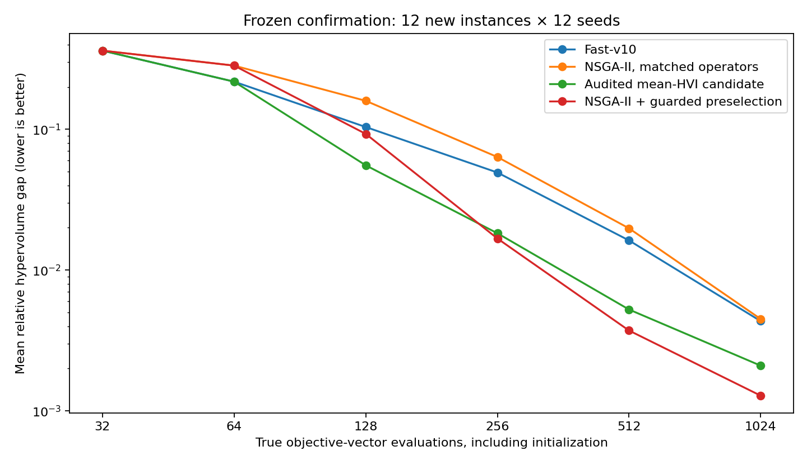
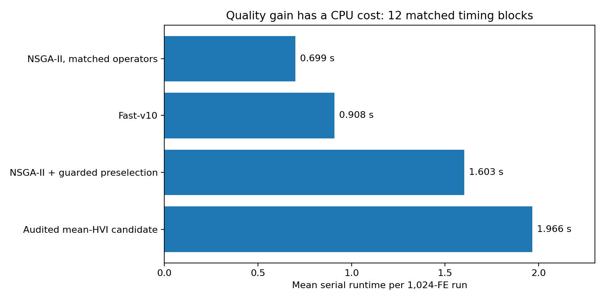

# MOSAIC v13 Harness Lab：本轮出现评价效率突破，但成本门仍未通过

日期：2026-09-05。**默认主线保持Fast-v10；H0以显式可选支线发布。**

## 1. 结论

本轮从“给算子重新发信用”转向“真实评价前筛选具体新解”。冻结主候选H0在12个新参数实例、每个12个新种子上，收敛曲线HV缺口AUC比Fast-v10下降 **16.037%**，比同算子同去重NSGA-II下降 **32.473%**。12个实例的种子均值均改善，两个主要检验Holm校正p=0.00048828。最终平均HV缺口下降51.75%，IGD+下降58.27%。这些是缺口/距离下降，不是总HV增加同样百分比。

然而独立串行的配对耗时中位比为 **2.134**，超过事先规定的1.8。故质量门通过、总门未通过；不把成本门改大，不宣称全领域或官方SOTA。144个seed配对中仍有15次AUC退化，最坏比值1.152；“12/12均值提升”不等于每次运行无退化。

## 2. 为什么不再围绕MoE发散

v12已经验证谱系信用实际触发，但未形成稳定改进。Fast-v10当前仍主要评价第一个未见合法候选。策略查重能防重复，却不能识别一个从未见过的新策略是否很差。因此本轮保留四种结构算子和主干，把学习对象从“算子平均价值”改为“候选的目标表现及预期前沿作用”。

研究材料见research/SOURCES.md：ACE（ICLR2026）、LongHorizon-Harness与AHE（2026预印本）启发职责分离、先预测后审计、可撤销局部干预；Offline-RaM（ICLR2025）启发排序质量审计；DB-SAEA（AAAI2026）启发生成与付费评价分开。没有运行这些论文原实现，没有把它们的Agent成绩当作我们的收益，没有神经LLM进入搜索回路。

## 3. 真实框架

```
Fast-v10生成原候选x0
    → 读取本run已付费观测，构建有版本的预测器
    → 模型权限门与20%主线探索
    → 保留x0，最多生成7个其他未见合法候选
    → 预测各目标，计算预测HV增量
    → 没有正预测增量则仍执行x0
    → 唯一EvaluationLedger：只评价选中一个点，扣1 FE
    → 只用真实F更新Pareto档案
    → 将预先预测与真实结果对照，更新误差记录
```

候选池生成、拟合、预测及查重都耗CPU，但不接触真实F。状态管理、候选执行和审计是Python逻辑组件，不是操作系统级安全隔离，也没有实现论文全部长期记忆与Agent工具链。

### 3.1 结构特征

psi(pi)包含实体是否启用、访问位置、有向边（含虚拟出发/结束点）和集合大小，维数p=3n+(n+1)^2。它不读取机床加工参数、路线价值、作业截止时间或参考前沿。相同实际策略的不同随机键可得到相同语义特征。

### 3.2 H0模型

初始32个真实样本确定目标缩放。64 FE后，每64 FE重拟合Ridge：

min_{W,c} ||ZW+1c^T-Y||_F^2+0.1||W||_F^2。

先在历史前段训练、后12–32条验证，再用全部已付费样本重拟合。权限要求最差目标Spearman>=0.35、平均归一化MAE<=0.25；足够多预先预测记录后，最近16次真实误差均值须<=0.35。NaN/Inf直接回退。这是经验验证阈值，不是校准概率或严格置信界。

### 3.3 选择新解，而不是混合专家输出

对预测均值mu(x)：

alpha(x)=HV(Y(A_t)∪{mu(x)};r)-HV(Y(A_t);r)。

只执行最大预测HVI的候选；全为零时不替换x0。r=(1.2,1.2)来自初始样本尺度，不来自测试前沿。这里没有积分预测后验，**不是严格EHVI**。Hσ用mu−0.15sigma作对照，其中线性sigma是验证RMSE、对同模型版本的候选是常数，只是残差裕量。

### 3.4 回退边界

全部关闭或整个运行从未干预时，主随机数流与原候选保留可以保持完整轨迹一致。一旦干预过，后来回退只能执行当时主干的原候选，不能撤回FE或恢复从未干预的平行轨迹。

## 4. 三轮开发保留全部反例

第一族包括最多8步/3失败终止的局部任务、24候选选4的树代理筛选、HVI/标量化/随机/原始特征等消融。在同一开发集，局部任务AUC约0.120123，原Fast-v10约0.115079；更长的局部任务不是自动改善。

第二族改为原候选保留、单次选择、逐目标线性/树模型比较。线性版本AUC约0.098801，树模型约0.114696、混合模型约0.100010。因此不是“模型越复杂越好”。

第三轮加入纯编码缓存、同NSGA-II后端、严格配对消融。H0开发AUC为0.098613，比Fast-v10降低14.308%，按初始PLAN选择并冻结。并发开发耗时提示明显成本问题，未据此假称串行门已经通过。

全部开发：176+160+144=480次，4开发实例×4seed，每次512FE；后两轮复用开发实例，不算额外独立任务。确认前配置、实例与源码哈希在protocol/SELECTION_BEFORE_CONFIRM.json。

## 5. 新实例确认

4个新RGV参数、4个合成折扣收益路线、4个新合成迟交作业；每个12seed、32种群、1024FE。所有seed最初32个X逐元素相同。参考前沿是每个8实体有限域109600条策略的独立穷举；搜索结束后才读取来评分。

|                      |     AUC↓ |   末期HV缺口↓ |   末期IGD+↓ |   完整容差前沿次数/144 |
|:---------------------|---------:|--------------:|------------:|-----------------------:|
| Fast-v10（主线）     | 0.114148 |      0.004346 |    0.002254 |              34.000000 |
| 同算子同去重 NSGA-II | 0.141932 |      0.004500 |    0.002513 |              32.000000 |
| H0：冻结主候选       | 0.095842 |      0.002097 |    0.000940 |              61.000000 |
| Hσ：残差裕量对照     | 0.095438 |      0.002055 |    0.001082 |              59.000000 |
| Hσ 去审计门          | 0.095494 |      0.002387 |    0.001112 |              58.000000 |
| 相同候选池随机选     | 0.114681 |      0.004131 |    0.002117 |              41.000000 |
| Hσ 使用原始随机键    | 0.108037 |      0.003566 |    0.001890 |              40.000000 |
| Hσ 使用标量化采集    | 0.104156 |      0.002038 |    0.001087 |              50.000000 |
| 同 Hσ 接到 NSGA-II   | 0.115715 |      0.001284 |    0.000813 |              62.000000 |

AUC为32、64、128、256、512、1024 FE的所有已观测点前沿缺口对log2(FE)的归一化梯形积分。末期指标使用算法实际返回的至多32点档案，两者分开。输出截断可能使“发现”和“返回”覆盖不同。目标参考归一化后保留10位小数，覆盖容差1e-9；不宣称真实数值数学意义的绝对精确性。

### 5.1 主要统计

先在每个实例内汇总12seed，再做12实例的配对Wilcoxon，主要两次比较Holm校正。H0对Fast-v10的AUC改善bootstrap95%区间为[12.12%,19.31%]。这是当前固定实例集合的重采样提示，不是任意问题分布上的保证。

| candidate             | baseline    |   instances |   wins |   ties |   losses |   improvement_pct |   worst_ratio |   holm_p |
|:----------------------|:------------|------------:|-------:|-------:|---------:|------------------:|--------------:|---------:|
| no_uncertainty_linear | fast_v10    |          12 |     12 |      0 |        0 |         16.037218 |      0.961929 | 0.000488 |
| no_uncertainty_linear | nsga2_typed |          12 |     12 |      0 |        0 |         32.473478 |      0.960634 | 0.000488 |

### 5.2 不能把所有收益算给审计门

H0在正常144次确认中，失准门关闭次数为0。Hσ与去门版本的实例均值只有1胜11平，AUC变化约0.059%，不显著。因此正常分布下，收益不能归因于审计门本身。NaN和极端乐观预测故障注入证明的是预测不入真实档案、错误能触发回退，不是正常测试质量提升。

### 5.3 严格配对消融

以Hσ为中心比较语义/原始特征、HVI/标量化、审计开/关，H0与Hσ只比较残差裕量。初始分析误将H0与raw/scalar直接当单因素配对；旧表保留，最终表纠正为真正匹配的对照，不影响冻结候选、任何搜索轨迹或主要检验。

| candidate             | baseline         |   wins |   ties |   losses |   improvement_pct |   holm_p |
|:----------------------|:-----------------|-------:|-------:|---------:|------------------:|---------:|
| no_uncertainty_linear | guarded_linear   |      5 |      0 |        7 |         -0.423254 | 1.000000 |
| guarded_linear        | unguarded_linear |      1 |     11 |        0 |          0.059234 | 1.000000 |
| guarded_linear        | random_residual  |     12 |      0 |        0 |         16.779333 | 0.001709 |
| guarded_linear        | raw_linear       |     12 |      0 |        0 |         11.661777 | 0.001709 |
| guarded_linear        | scalar_linear    |     12 |      0 |        0 |          8.370526 | 0.001709 |
| nsga2_guarded         | nsga2_typed      |     12 |      0 |        0 |         18.471376 | 0.001709 |
| guarded_linear        | nsga2_guarded    |     11 |      0 |        1 |         17.523546 | 0.001709 |

结果支持结构特征、模型筛选和HVI采集；不支持把不确定性裕量或正常情况下的审计门当主要收益来源。Hσ接入NSGA-II也改善其AUC约18.47%，说明预筛选不专属于MOSAIC。同Hσ下MOSAIC早期曲线更好，但NSGA-II的末期平均HV缺口与IGD+更小，不能宣称单一方法全指标支配。

### 5.4 模型族差异

末期收益主要来自合成作业和路线；RGV扰动族的末期平均缺口从约0.002618降到0.002566，改善很小。所有家族/实例的好坏结果在family_summary.csv与per_task.csv，不只展示总体平均。

## 6. 原国赛参数补充

真实来源仍是2018国赛B的限定模型，不是原题全部动态调度小问。新seed13801–13808、每组8次：

| algorithm             |      runs |      auc |   final_gap |      hits |
|:----------------------|----------:|---------:|------------:|----------:|
| fast_v10              | 24.000000 | 0.107473 |    0.000254 | 20.000000 |
| guarded_linear        | 24.000000 | 0.093078 |    0.000000 | 24.000000 |
| no_uncertainty_linear | 24.000000 | 0.090807 |    0.000028 | 23.000000 |
| nsga2_guarded         | 24.000000 | 0.108201 |    0.000268 | 19.000000 |
| nsga2_typed           | 24.000000 | 0.131645 |    0.000260 | 22.000000 |

H0为23/24完整容差前沿，Fast-v10为20/24，NSGA-II为22/24。Hσ为24/24，但不能看到确认成绩后把预选H0改成Hσ。可以同时保留并报告，不能重新选赢家。

## 7. 更大规模压力测试

新增n=12/16的作业和路线共4实例，每个6seed、2048FE。无法全穷举，使用所有方法已评价点共同构成的经验参考，不是精确前沿，也不与主要检验混合。

| algorithm             |      runs |      auc |   final_gap |      igd |
|:----------------------|----------:|---------:|------------:|---------:|
| fast_v10              | 24.000000 | 0.244652 |    0.041002 | 0.020230 |
| no_uncertainty_linear | 24.000000 | 0.210063 |    0.018687 | 0.009036 |
| nsga2_guarded         | 24.000000 | 0.238983 |    0.011278 | 0.005834 |
| nsga2_typed           | 24.000000 | 0.289362 |    0.029754 | 0.015828 |

H0相对Fast-v10的经验AUC下降约14.14%。四个压力实例的均值均改善，但仅4实例、已知模型家族，证据仍初步。NSGA-II+Hσ的末期缺口再次较低，保留这个反例。

## 8. CPU成本门

清洁串行：3实例×4seed、相同随机执行顺序；没有其他本轮实验或测试并行。

| algorithm             |     count |     mean |   median |
|:----------------------|----------:|---------:|---------:|
| fast_v10              | 12.000000 | 0.908436 | 0.833473 |
| guarded_linear        | 12.000000 | 1.912397 | 1.813045 |
| no_uncertainty_linear | 12.000000 | 1.966235 | 1.776444 |
| nsga2_guarded         | 12.000000 | 1.602560 | 1.500527 |
| nsga2_typed           | 12.000000 | 0.698718 | 0.572600 |

H0配对中位比2.134>1.8，因此总门失败，默认保留Fast-v10。第一次串行计时与约8秒单元测试重叠，完整保存为serial_contended，之后整套重跑；两套均计入总FE，不挑最快样本。

H0确认阶段平均每run替换约82个原候选（总预算的8.0%），但为此额外生成约520万次纯候选（144run合计，平均约3.61万/run），这解释了实际开销来源的一部分：不是只有回归拟合成本，重复生成和编码也很多。

按测得时间、相同1024FE作额外目标延时的算术估计，每次真实目标评价若再增加约0.365毫秒，典型配对的总时间比可进入1.8限制。**这是成本模型推算，不是执行过高成本应用或通过sleep制造的实测加速，也不证明同精度求解时间更短。**

## 9. 全量审计

- 2112次正式完整运行、2,015,232次搜索评价，包含两套60次串行计时。
- 18个有限数值参考、1,972,800次独立参考评价。
- 81次记录在案的丢弃JIT预热，不给搜索器使用。
- 1,191,936条预测记录检查时序；36次独立从训练前缀重建线性模型，最大预测差4.44e-16。
- 32个持久化完整配对验证all-off/缓存等价，含逐次X/F和末期返回档案，而非仅指标相同。
- 所有初始化/physical FE/ledger/预算一致。档案输出仅来自真实F。
- 61项当前与继承测试通过。正式搜索不含调试smoke、cProfile或单元测试的额外模型调用；不把统计称为整个会话所有CPU/FE总成本。

## 10. 发布决定

质量门：通过。成本门：未通过。**H0是有真实评价效率增益的可选候选，不替代便宜目标函数上的默认Fast-v10。**

本轮最明确的突破不是更多专家或更复杂路由，而是：结构表示→学习具体候选→将真实评价从随机未见候选转向更可能改善前沿的候选。基本SAEA/Ridge/HVI都已有文献；这一组合仍需要更多问题类型和更强作者原实现对照，不能叫官方或通用SOTA。

所有最新论文只作为设计依据。没有完整CEC2025、没有最新论文全部原实现对照、没有训练LLM Agent、没有噪声/一般约束/高维连续、多目标M>2的本轮升级，没有中途恢复的run-internal checkpoint。基线代码保留，失败开发分支保留，支持独立复查。

## 11. 使用与交付

```bash
python -m pip install -r requirements.txt
python examples/demo.py --strategy incumbent --group 1 --budget 1024
python examples/demo.py --strategy audited_infill --group 1 --budget 1024
python -m pytest -q tests vendor/baseline_v10/tests
```

数学细节见docs/METHODS_CN.md；实验门见results/analysis/GATES.json；全部轨迹和错误/预测日志见results各阶段；数据来源、选择时间、源码哈希见protocol；来源状态见research/SOURCES.md。




